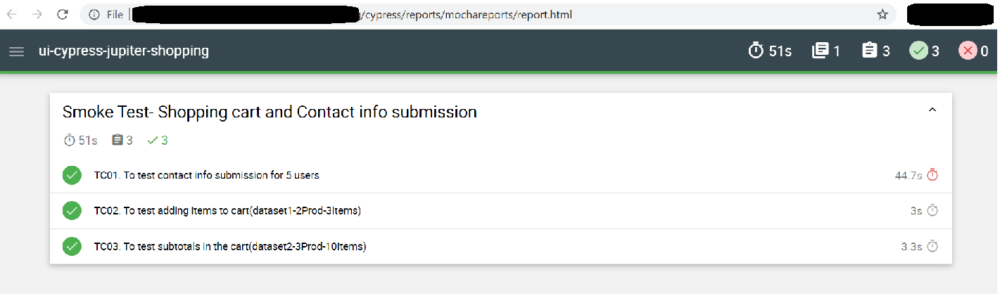
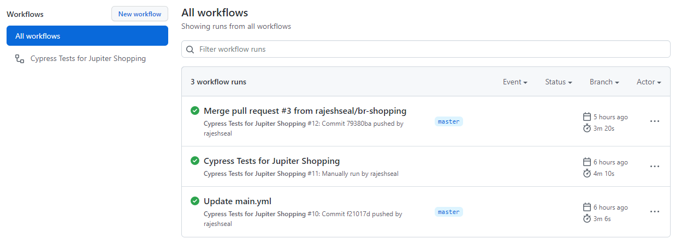
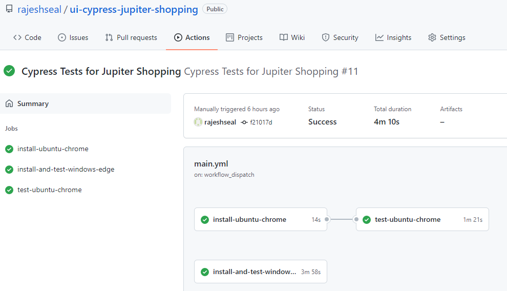

# Cypress - Jupiter Shopping Portal - Smoke Test

## About:   
The project is to mimic user behavior to navigate to shopping portal and performing actions.
The following use cases are tested
1. Filling up of contact form and sumbission
2. Adding products to cart and validation that products are added to cart
3. Addition of multiple products in multiple quanties and validation of the subtotals in the cart table

Tech Stack: `cypress` `JavaScript` `node` | AUT: https://jupiter.cloud.planittesting.com

---
## Features:  
The framework has following attributes
### Data Driven
The framework reads the `json` data files and uses for the test data and is agnostic to the records in data files.
### CI
The test framework is configured to work with GitHub Actions CI upon `push` and `manual` trigger.
The current configured jobs test the following combinations-
1. Ubuntu + Chrome
2. Windows + Edge
Please refer the reference images in section `Running the tests in CI`
### Report
'mocha awesome reporter' is employed to compile the reports per spec and tests underneath the spec when tests are run through cli.
The report is created in `html` format and is stored under `/reports/mochareports/report.html`
#### 
### CLI 
The tests can be triggered via cypress ui and cli.
Please refer the `reference` section and `Running the tests in local machine`

---
## How to setup on local machine:
Clone repo on your system. Please make sure you have `Node` installed on your system.

1. Run `npm install` to install dependencies on system.
 
---
## Running the tests in local machine:
1. Execute `npm run test` command in terminal to run the tests in headless mode.
2. Execute `npm run test-headed` command in terminal to run the tests in headed mode.
3. Execute `npm run cypress-ui-open` command in terminal to open the Cypress GUI.

---
## Running the tests in CI:
The tests in CI can be run in 2 ways-
1. Auto run on `push` event.
2. Manual Run.
#### 
#### 

---
## Asssumtions:
1. AUT is `up and running` with `no change` to workflow.

---
## Enhancements:
1. Addition of required business assertions.
2. Convert the form submission test case to generate `dynamic` tests.
3. Creation of `utility` library and move functions to them.
4. `Containerize` the framework.

---
## References
1. Cypress Command Line : https://docs.cypress.io/guides/guides/command-line#Commands

---